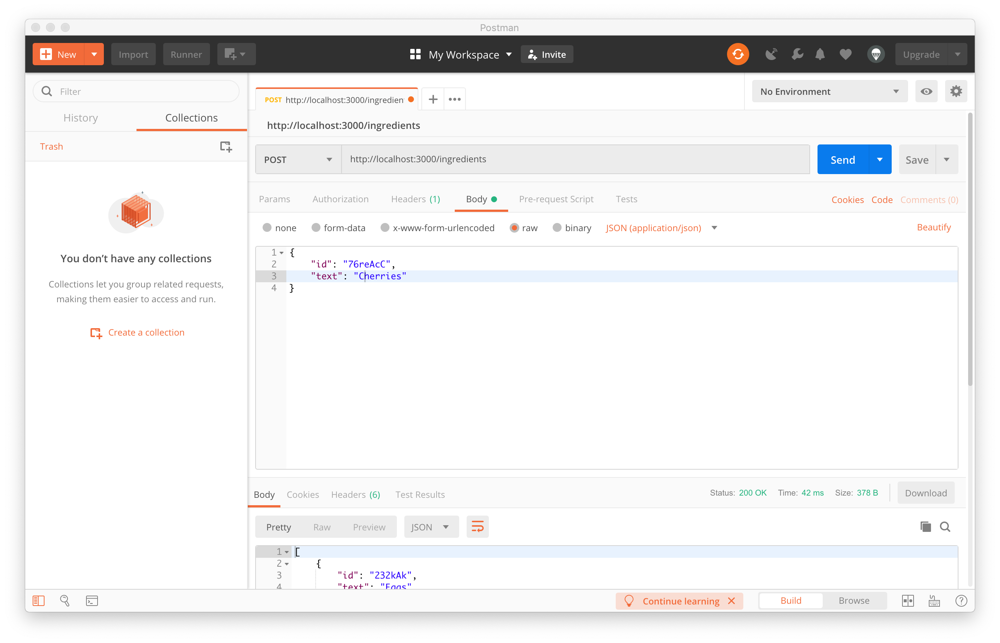

# NodeJS
And node js server with instruction of postman and npm
[Readme Doc](https://help.github.com/articles/basic-writing-and-formatting-syntax/)

## Set up ##

### 1. Make an folder and cd into it. ###
```
mkdir first-API
cd first-API
touch server.js
```

### 2. Install npm packages. ###
``` 
npm init
npm install --save express
npm install --save body-parser
npm install -g nodemon
```

### 3. Install npm packages. ###
```node server.js```

## Postman ##


